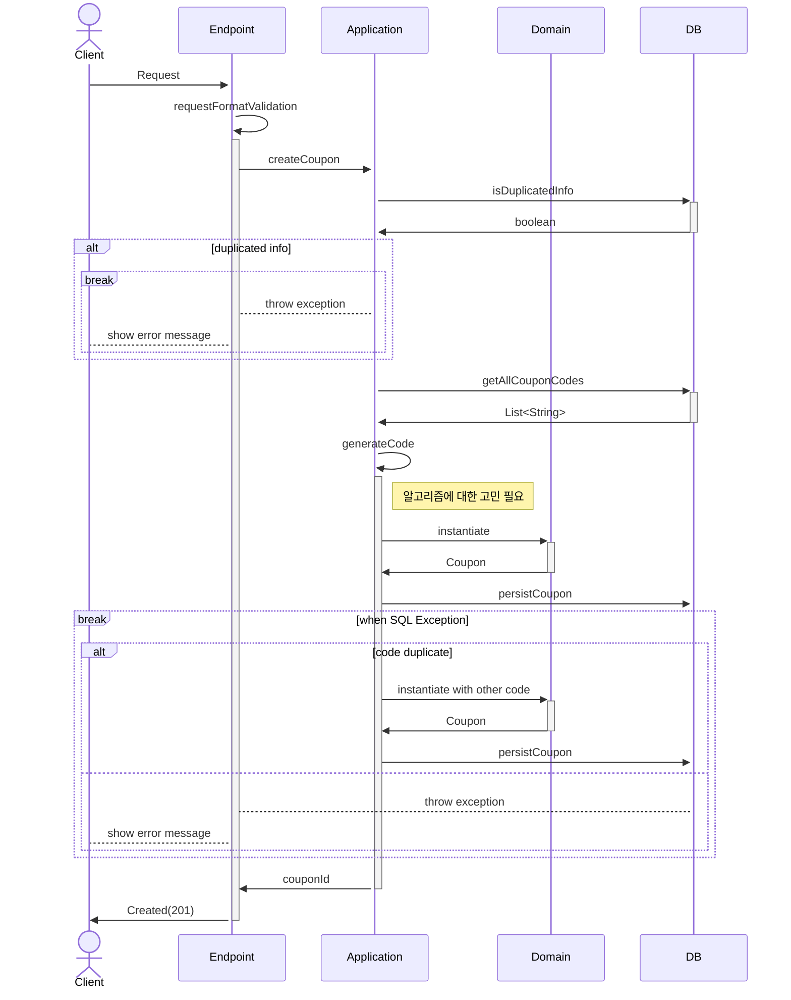
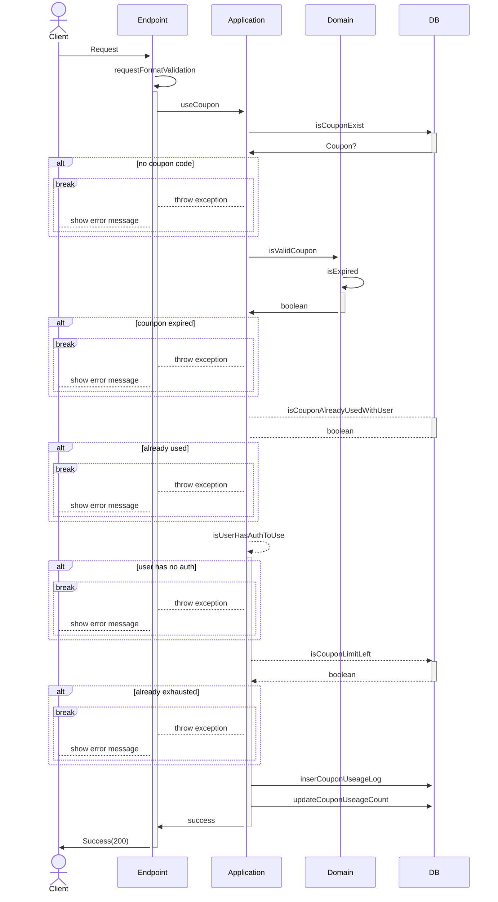

# 쿠폰 푸시 서버 시퀀스
version : 객체에 매핑하기 전 단계

## 문서의 목적
이 문서는 '쿠폰 발행'과 '쿠폰 사용' 이라는 두 시나리오에 대해서 스퀀스 다이어그램을 그려서 다음의 세가지 목적을 가지고 작성되었습니다.
1. 서버 로직 구체화
2. 필요 데이터 정리
3. 추가 고민사항을 도출하여 기술적 선택에 가이드라인 제공

## 문서의 형식
문서는 다음과 같은 형식으로 되어 있습니다.
1. 시퀀스 다이어그램
2. 데이터
3. 고민 해야할 사항

데이터는 각 단계에서 필요한 데이터를 명시하였으며, json 포맷에 key: type 형태로 작성하였습니다. Nullable 은 type? 으로 표현하였습니다.

[시나리오 - 쿠폰발급](#쿠폰-발급coupon-publish) <br/>
[시나리오 - 쿠폰사용](#쿠폰-사용coupon-use)


---
## 쿠폰 발급(Coupon Publish)


### createCoupon
```js
{
    "title": string, // 쿠폰의 제목
    "desc": string, // 쿠폰의 내용
    "startTime": datetime, // 쿠폰 적용 시작 시간
    "endTime": datetime, // 쿠폰 적용 마감 시간
    "couponeType": string, // 쿠폰의 타입
    "targetUserId": long?, // 개인 지정시 개인의 id
    "targetGroupId": long?, // 그룹 지정시 그룹의 id
    "discountType": string, // 정액 할인 or 정률 할인
    "discountAmount": int, // 할인량, 
    "publisher": long, // 쿠폰 발행자의 id
    "reason": string, // 쿠폰 발행 사유
}
```

### isDuplicatedInfo
```js
{
    "title": string, // 쿠폰의 제목
    "description": string, // 쿠폰의 내용
    "startTime": datetime, // 쿠폰 적용 시작 시간
    "endTime": datetime, // 쿠폰 적용 마감 시간
    "couponeType": string, // 쿠폰의 타입
    "targetUserId": long?, // 개인 지정시 개인의 id
    "targetGroupId": long?, // 그룹 지정시 그룹의 id
}
```

### 추가 고민 포인트

* 최대한 효율적으로 중복되지 않은 coupon coed 를 생성하기 위한 알고리즘을 만들어야 한다.
* 만약 info, code duplicate 체크를 했는데, 그 쿠폰이 persist 되기 전에 또 다시 동일한 정보로 쿠폰 발행 요청이 들어오고, 기존의 발행 요청보다 먼저 persist 된다면 문제가 발생한다. 이를 막기위한 효과적인 방법은 없을까?

---

## 쿠폰 사용(Coupon Use)



### useCoupon
```js
{
    "userId": long,
    "couponCode": string,
}
```

### 추가 고민 포인트
* 이용자가 쿠폰 사용을 원할때는 시간에 대한 체크를 가장 먼저한다. 이렇게 함으로써 서버 처리 과정으로 인해 쿠폰을 사용하지 못하는 케이스를 최대한 줄인다.
* 이용자가 쿠폰 사용을 원할때 소진 한도에 대한 체크를 가장 나중에 한다. 소진 한도에 대한 체크를 먼저 하게 되면 쓰레드간 처리 속도 차이가 있을 경우 쿠폰 소진 한도를 넘어서서 쿠폰이 사용될 위험이 커진다.
* 잘못된 쿠폰 코드를 입력하는 행위가 연속되면 어뷰징 행위일 수 있다. 이러한 사항을 기록하고 일시저으로 해당 클라이언트의 쿠폰 사용을 차단하는 장치가 필요하지 않을까?

